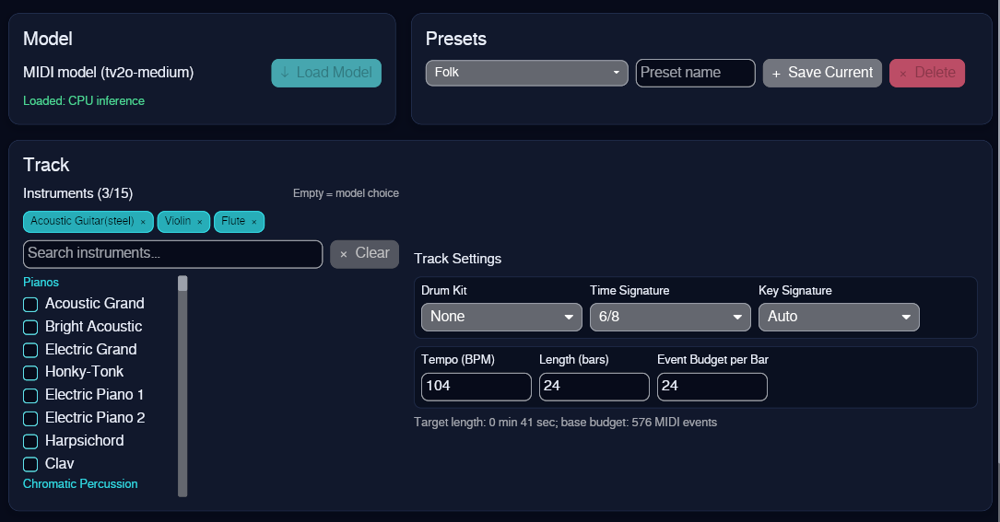
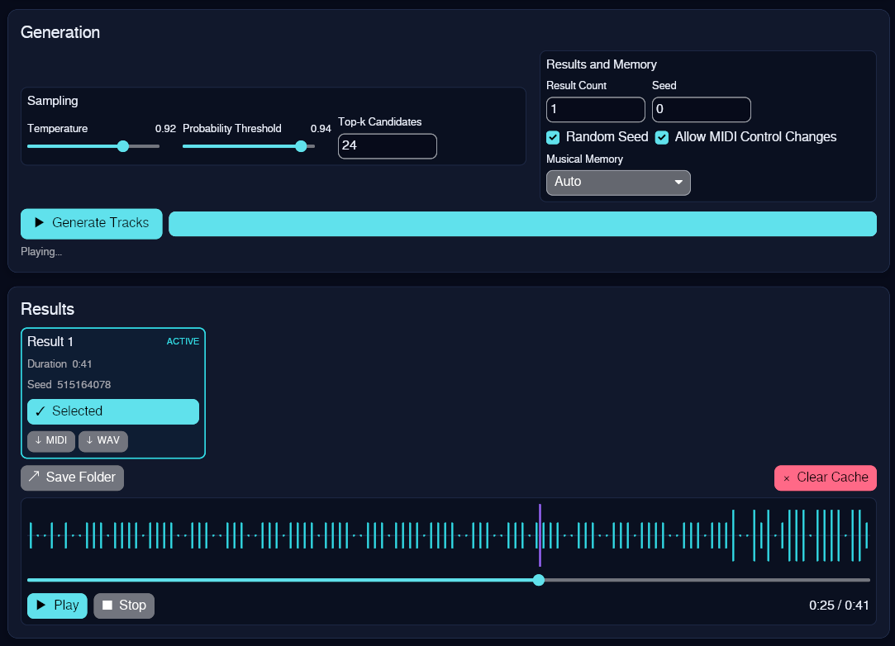

# gen_music_ai

[](https://github.com/ivangor246/gen_music_ai/actions/workflows/ci.yml)
[](https://github.com/ivangor246/gen_music_ai/actions/workflows/licenses.yml)
[](LICENSE)

`gen_music_ai` is a desktop application for generating multi-instrument music locally. Configure
instruments and generation parameters, preview the results, and export selected tracks as
Standard MIDI or WAV.

Generation runs entirely on the CPU and does not require a GPU or a remote inference service.

## Interface





## Features

- Generate tracks with up to 15 selected General MIDI instruments, or let the model choose.
- Audition every General MIDI instrument directly from the searchable selection list.
- Configure drum kit, tempo, time signature, key signature, length, and event budget.
- Tune temperature, top-p, top-k, result count, seed, control changes, and musical memory.
- Start from built-in style presets or save and delete custom presets.
- Generate several candidates with reproducible seeds and cancel an active generation.
- Preview any result with playback, seeking, and a note-density timeline.
- Export each result directly from its card as `.mid` or as 44.1 kHz, 16-bit stereo `.wav`.
- Keep long compositions in a disk-backed token cache instead of retaining their complete token
  history in memory.
- Select a compatible model from the built-in catalog and download, pause, resume, load, switch,
  or remove it without reinstalling the application.

## Download

Unsigned archives for x86-64 Linux, Windows, and macOS are published on the
[GitHub Releases page](https://github.com/ivangor246/gen_music_ai/releases). Each archive has a
matching `.sha256` file. Verify it after downloading, replacing the filename with the selected
artifact:

```bash
sha256sum --check gen_music_ai-0.1.0-x86_64-unknown-linux-gnu.tar.gz.sha256
```

Extract the archive and run `gen_music_ai` on Linux, `gen_music_ai.exe` on Windows, or
`Gen Music AI.app` on macOS. Select a model and press **Download & Load** on first use. The app
downloads the pinned checkpoint over HTTPS, verifies its size and SHA-256 digest, and stores it
outside the executable in the platform application data directory. The SoundFont remains bundled
with release builds. Because the builds are currently unsigned, the operating system may ask for
confirmation before the first launch.

## Runtime Notes

- A 64-bit x86 processor and approximately 450 MB of disk space per installed model, in addition
  to temporary download and generation files.
- An internet connection for the first model download; generation remains fully local afterward.
- An audio output device for live playback and WAV rendering.
- A GPU is neither required nor currently used.

Model loading and generation require substantially more memory than the checkpoint size because
the model weights are converted to `f32` for CPU inference. Larger result counts and musical
memory settings increase peak memory use. Generation speed depends on the CPU and selected
settings.

On a machine short on memory, enable **Half Precision (f16)** in the Model panel. This halves
both the resident weights (about 933 MB down to 466 MB) and the attention caches. Decoding is
bound by how many bytes of weights are read per event rather than by arithmetic, so this is
also the setting that most directly affects speed — though the gain depends on the CPU having
usable `f16` support, so it is worth timing on your own machine. Output differs slightly from
`f32`, which remains the default. The choice persists
between sessions, and toggling it reloads an already-loaded model. `MIDI_MODEL_DTYPE=f16` or
`=f32` overrides it for headless profiling.

The app caps tensor-math threads at half the logical cores so the desktop stays responsive, and
refuses a run whose attention caches would not fit in available memory instead of swapping.
`RAYON_NUM_THREADS` overrides the thread count.

To prevent accidental runaway jobs, the interface limits a request to 256 bars, 128 base events
per bar, 30 minutes of estimated playback, and 8,192 base events across all requested results.

## Run from Source

### Prerequisites

- Rust 1.89.0, installed automatically by `rustup` from `rust-toolchain.toml`.
- `curl` and either `sha256sum` or `shasum` for downloading development assets.
- Approximately 50 MB of repository disk space for the SoundFont and 450 MB in the application
  data directory for each installed model, in addition to build artifacts.
- An audio output device for live playback.

On Debian and Ubuntu, install the ALSA development files required by `cpal`:

```bash
sudo apt install pkg-config libasound2-dev
```

Download the pinned SoundFont after cloning the repository:

```bash
bash scripts/download-assets.sh
```

The script verifies the SHA-256 checksum and skips a valid existing file.

Run the application using the committed dependency lockfile:

```bash
cargo run --locked
```

In the application:

1. Select a model, press **Download & Load**, and wait until it is ready.
2. Choose a preset or configure the instruments and generation parameters.
3. Select **Generate Tracks**.
4. Use a result card to preview the track or export it as MIDI or WAV.

## Release Build

Every build loads model checkpoints from the platform application data directory. A default
development build reads the SoundFont from `assets/soundfont.sf2`:

```bash
cargo build --release --locked
```

Use the `embed-soundfont` feature to include only the SoundFont in the executable, as the release
workflow does:

```bash
cargo build --release --locked --features embed-soundfont
```

Model checkpoints are never compiled into the binary. This keeps releases smaller and allows new
catalog entries to be selected without changing the model loader. The SoundFont is required before
running the default development build or compiling with `embed-soundfont`.

Run the release workflow manually to build and checksum all platform archives without publishing
a GitHub Release. Manual artifacts are retained for three days for inspection. Pushing a tag that
matches the package version, such as `v0.1.0`, runs the same checks and publishes the release only
after every archive passes checksum verification.

The workflow produces unsigned archives for x86-64 Linux, Windows, and macOS
together with SHA-256 checksum files and a corresponding source archive. Each binary archive
includes the license notices, relinking instructions, and required third-party source packages.
Update the version in `Cargo.toml` before creating a new release tag. The macOS archive contains
an application bundle, while the Linux archive includes desktop integration metadata and the
Windows archive includes the application icon for portable distribution.

## User Data and Exports

Downloaded models, presets, the last save directory, and generated token caches are stored in the
platform-specific application data directory selected by the
[`directories`](https://crates.io/crates/directories) crate. They are not written next to the
executable. The selected model persists between sessions. **Remove** asks for confirmation and
deletes only that model's downloaded files; it does not affect exports or other application data.

MIDI and WAV files are created only after an explicit save action. The save dialog starts in the
system Downloads directory and remembers the last selected directory. Clearing the application
cache removes generated token histories and makes those unsaved results unavailable; it does not
delete previously exported files.

## Tests

Only unit tests and lightweight MIDI/timeline integration tests are kept in the repository. The
test suite cannot load a model checkpoint or SoundFont. Model parity, end-to-end generation, WAV
rendering, and generation benchmarks were removed because compiling or running them can exhaust a
development machine's memory.

On Linux, always run the suite through the fail-closed memory wrapper:

```bash
bash scripts/test.sh
```

The wrapper limits the complete Cargo process tree to at most 3 GiB and one build/test thread,
disables swap for the cgroup, and refuses to run if `systemd-run` cannot enforce the limit. Cargo
also defaults to one build job with test debug symbols disabled, so accidental direct invocations
cannot start several large `rustc` processes concurrently.

On Windows and macOS, where this Linux cgroup wrapper is unavailable, run the same lightweight
targets with Cargo:

```bash
cargo test --locked
```

Check formatting with:

```bash
cargo fmt --all -- --check
```

Audit the licenses in the locked Rust dependency graph with all features enabled using
[`cargo-deny`](https://github.com/EmbarkStudios/cargo-deny):

```bash
cargo deny --all-features --locked check licenses
```

The license policy is defined in `deny.toml` and is enforced automatically for pushes and pull
requests. Copyleft exceptions are limited to the pinned packages documented in
`THIRD_PARTY_NOTICES.md`.

Pushes and pull requests also run formatting, Clippy, and the lightweight test suite in CI.
Windows and macOS additionally compile the default external-model path.

## Project Structure

- `src/core/` — model implementation, sampling constraints, tokenizer, and MIDI encoding.
- `src/services/` — generation, token storage, playback, synthesis, export, presets, and settings.
- `src/ui/` — Iced application state, messages, tasks, views, and timeline visualization.
- `models/catalog.json` — built-in, versioned catalog of supported model artifacts and checksums.
- `assets/` — application icon resources and the downloaded SoundFont location.
- `licenses/` — complete license and attribution texts for bundled third-party components.
- `docs/` — interface screenshots and the release checklist.
- `packaging/` — platform-specific desktop metadata and icon resources.
- `scripts/` — reproducible asset and third-party source downloads with checksum verification.
- `tests/` — lightweight MIDI and timeline integration tests and their small fixtures.

## License

Except where otherwise noted, the source code in this repository is licensed under the
[Apache License 2.0](LICENSE).

This project is based in part on the Apache-2.0-licensed
[SkyTNT MIDI model](https://github.com/SkyTNT/midi-model). The model checkpoint, SoundFont, and
Rust dependencies retain their own licenses and are not relicensed by this project. See
[THIRD_PARTY_NOTICES.md](THIRD_PARTY_NOTICES.md) before redistributing source code, assets, or
compiled binaries. Binary distributors must also follow the OxiSynth source and relinking
requirements in [RELINKING.md](RELINKING.md).

Release changes are recorded in [CHANGELOG.md](CHANGELOG.md). Please report security issues using
the process described in [SECURITY.md](SECURITY.md).
